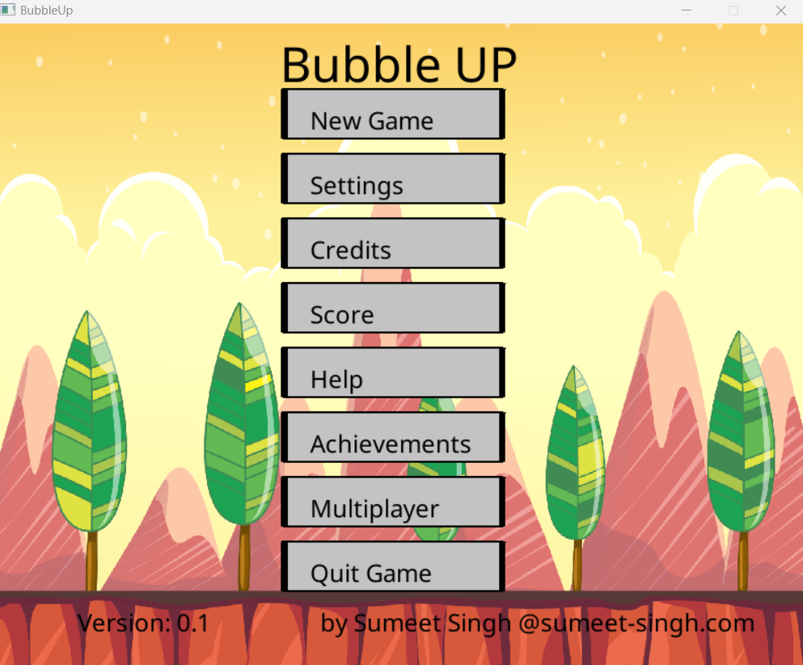
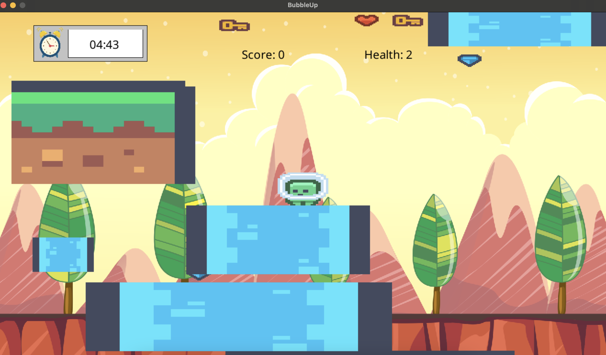

# BubbleUP

Version: 0.2 NOT READY FOR PLAYING

* Author: Sumeet Singh
* Dated: 09/04/2024
* Minimum C++ Standard: C++17
* Description: Full documentation located here "./docs/html/mainpage.html"
* License: MIT License see "./LICENSE" file

## DESCRIPTION

BubbleUP is a combined C++ 2D Game Engine with a built in feature-rich demonstration 2D game built 
ontop of the SDL Framework. It includes classes for constructing interactive Buttons and fields to 
create stunning GUI, Forms and HUD. Includes countless game entities and level editor to create unique 
stunning 2D games. Has built in scenes for achievements, leaderboards, multiplayer, and more. You can 
download and easily modify this open-source code to create your own game by following the 
instructions here.

### GUI

Uses a BaseButton class to encapsulate logic for different GUI button objects derived from SDL 
Framework for various GUI elements, e.g., volume sliders, input fields, clickable radios, checkboxes,
 and buttons. These are initialized within a vector to hold all the different buttons, enabling 
 navigation through them with keyboard movement, highlighting, and building a GUI with buttons, 
 rendering text/draws, and handles.

### GAME

Has a Game Engine Entity Base Class with four subclass entities: Players, Items, Enemies, and 
Obstacles (boundaries). Each has its own logic for movement and collision. A basic displacement 
camera is used to draw the location of entities. The existing game, "Bubble UP," is a simple 
"reach the highest score" game by collecting valuable items while trying to avoid touching 
enemies, all while navigating obstacles blocking the way.

### LEADERBOARDS

Has an UpdateApp class for saving achievements, settings, and scoring statistics to file, with 
the ability to load them in memory to view in-game. Achievements can be accessible to push to 
any platform. Achievements can be shared online with other players and leaderboard statistics 
are also available for competitive play.

### MULTIPLAYER

Uses WebserverClient and WebserverHost classes to create a game client and webserver multiplayer 
lobby functionality to create custom games, join others, make and add friends, and communicate 
and compete online.

### LEVEL EDITOR

Includes a highly customisable level editor for importing textures and creating unique custom 
game maps and exporting them as .wad files for sharing, modding, and playing custom games both 
in single and multiplayer.

### ACCESSIBILITY

The vast array of settings are present, including enabling vsync, resolution changes, volume 
control, different language support, as well as keybinding functionality.

_______________________________________________________________________________________________________

## REQUIREMENTS

* OS: 
    * Windows 10, 11
    * MacOS 13 - 14
    * Ubuntu 22.04 - 24.04
* Processor: at least a Core i3 or AMD CPU equivalent
* RAM: 4 GB RAM
* Graphics: at least a HD compatible CPU/GPU
* Storage: 5 GB Free

## HOW TO PLAY

1. No installation required. Simply download game folder from here
https://github.com/SumeetSinghJi/BubbleUp/archive/refs/heads/main.zip
extract and run the relevant executable for your operating system (OS) below to play;
* Windows: ./bin/windows/BubbleUp.exe
* Linux: ./bin/linux/BubbleUp
* MacOS: ./bin/mac/BubbleUp

## ACCESSIBILITY - LANGUAGES

Full supported languages.
1. ENGLISH (English)
2. 日本語 (Japanese)
Languages changed in game via Settings - Language button.

## ACCESSIBILITY - SUPPORTED CONTROLLERS & INPUTS

Full Controller supports: Mouse, Keyboard, Gamepad, Touch
Keybindings changed in game via Settings - Keybindings button.

## ACCESSIBILITY - KEYBINDS & CONTROLS

| KEYBOARD | GAMEPAD | MOUSE/TOUCH | ACTION                  |
|----------|---------|-------------|-------------------------|
| UP       | UP      |             | Move up                 |
| DOWN     | DOWN    |             | Move Down               |
| LEFT     | LEFT    |             | Move Left               |
| RIGHT    | RIGHT   |             | Move Right              |
| ENTER    | A       | Left Click  | Accept/Use              |
| ESC      | B       | Right Click | Cancel/Return/Exit      |
| n/a      | n/a     | Mousewheel  | Scroll Up/Down          |

_______________________________________________________________________________________________________

## INTRODUCTION

"As the author, I always wanted to learn programming. Growing up in the 90s shareware gaming era, the internet 
wasn't as widespread, fast, affordable, or accessible during that time period. The lack of the Internet left 
very few ways to enjoy video games. Electronic games were mainly accessed through the arcade, which was an 
expensive hobby, handheld and home game consoles, which had little public documentation, leaving the only way 
to judge a game's fun to viewing the boxed art, leaving little room for errors in judgment and another 
expensive endeavor.

Thankfully, operating systems at the time had free inbuilt games that became the subject of speculation and 
fascination. However, the only way to enjoy the games at that age or time was limited to access on school 
computers with limited libraries of installed games, and with supervision, leaving approval of games played up 
to the ever-dominant and watchful eyes of the teachers' moral approval.

This left the only way to enjoy games repeatedly without any costly endeavors were the utopian abundance of 
demonstration games known as demos, which were free, limited in gameplay and/or ownership rights, samples of 
computer games. 
The easiest method of obtaining them was from digital storage media at the time known as, floppy disks shortened 
to floppies and CD-ROMs shortened to CDs bundled as free promotional samples with technology magazines that 
were often purchased from news agencies.

The low cost of the barrier, ease, often non-existent standards to program and develop computer games meant that 
many game developers published their works often through the aforementioned media, and the time period was 
colloquially and fondly referred to as the Shareware era. Shareware is any commercial software that is 
distributed free, encouraging owners to donate or pay for the complete licensed and often unlocked version.
Shareware games could be copied for free on other media and spread to families and friends, bringing the 
cost barrier to electronic gaming down to accessible levels.

Floppies and CDs would be inserted and the drive accessed on the computer, where you could browse the game's 
contents known as folders in Windows. Games folders would contain many files such as images, videos, music known 
as assets used by the game, as well as the executables, the software to run and play the game. The lack of 
knowledge on video games and digital media at the time meant that browsing a game's content on the computer could 
lead to finding cheats about a game, viewing fascinating artwork, stories in game manuals, that could be copied 
to the local computer and accessed anytime, leading to a revolution in video game ownership contrasted to 
expensive arcade visits with coin slot machines and foreign expensive priced game consoles and cartridge games.

The process of acquiring a new game-filled floppy or CD with new mysterious experiences and browsing the contents 
on a computer and adding them to my growing collection created lifelong positive memories. The acquisition of 
new games and thus technology became my passion.

In memory of the Shareware developers that created media that brought joy to my life, I wanted to replicate the 
process. Learning video game development was a step in the right direction. C++ was a programming language at the 
time I remember in my school years; I could recall many advising it as the next best technology. Although C++
has been overtaken by newer programming languages, I wanted to replicate the nostalgic old filesystem browsing and
opening of game readme's, textures, map files and thus create a similar simple 90s-style shareware era game.

Thus, I hope this story and game evoke similar enjoyable moments for you. I encourage you, at least once in your 
life, to pursue a nostalgic lifelong fascination you have, as it may bring closure to subconscious desires."

                                      Sumeet Singh, 29th February 2024.

_______________________________________________________________________________________________________

### Compiling - Automatic - CI/CD

There is a Github action here: .github\workflows\actions.yml
It will on push
1. Build tests
2. Run tests
3. On tests pass build main
4. upload main os binaries as artefacts for manual download

### COMPILING - Manual

the included .vscode has build tasks for each OS with a relevant default compiler
* g++ - Windows
* g++ - Linux
* clang - MacOS
* cppcheck - Windows
the included c_cpp_properties has JSON for all OS
The Included CMAKElists.txt can be used to build a executable across any OS platform

### REQUIREMENTS

All requirements can easily be found here: .github\workflows\actions.yml

* MYSY2 - if using Windows
* clang - if using Windows
* cppcheck - to test for errors
* VSCode: the included .vscode tasks.json arguments are prefilled with default locations of 
libraries above
* CMAKE: the included CMAKELists.txt can be used to build the project
* Doxygen: the included doxyfile can be used to generate documentation

#### LIBRARIES USED

* boost::asio & beast: for POST Account details, and multiplayer
    * libboost_system-mt.dll
* curl: for downloading online game update
    * libcurl-4.dll
* ffmpeg: for video audio codec playback
    * swresample-5.dll
    * avutil-59.dll
    * avformat-61.dll
    * avcodec-61.dll
    * libavformat.so - for linux
    * libavutil.so - for linux
    * libavcodec.so - for linux
    * libswresample.so - for linux
    * libswscale.so - for linux
* Google Test: for tests 
* libzip: for unzipping game update
    * libzip.dll
* SDL2: for Window, Event Loop, Input handling, Rendering
    * SDL2.dll
* SDL2_image: for images
    * SDL2_image.dll
* SDL2_mixer: for audio
    * SDL2_mixer.dll
* SDL2_ttf: for rendering text to window
    * SDL2_TTF.dll
* zlib: required for building libzip package

## INCLUDED REPOSITORY FILES & DIRECTORIES FOR DATA INTEGRITY
* README.md: This document. Use guide on software BubbleUp 
* TODO.md: roadmap, changelog, version control log
* LICENSE: Software licensing file
* CREDITS.md: Contributors to develop program and sources of asset resources
* Doxyfile, mainpage.md, ./docs: For C++ library Doxygen to build code documentation
* .\etc: miscelanous files such as binaries for internet data  transmission between webserver and client multiplayer gameplay.
* .\bin: build directory legacy files when compiling/building software binaries for multiple operating systems. The actual final software executable is in root .\ due to proximity of .dll or .so files and relative paths to other directores such as ./assets, ./headers, ./src, etc..
* game_log.txt: Debug log output of executed software. Regenerated everytime sofware is run.
* gamesave.txt: Saved gameplay and settings of users gameplay.
* .docs\policies: contains the locations of various software usage/gameplay translated terms of use and policies
* docs\SDL_keycodes.csv: Default keybinds used by SDL library

## MODDING

To use BubbleUP (This Game Engine with inbuilt Game) to create a new game, follow the steps below.

Game has no included story, only default textures with open-source licensing and top down 
platform physics coding per default.

Game uses standard SDL Game Development practice of starting, running and exiting SDL.
Within running sdl function you have while the game hasn't quit calls for handles()
updates() and draws for relevant scenes. Each game scene e.g. scene == 31 calls its own one time
setup that toggles a scene setup global variable bool. You can put your level setup here.
e.g. setup_scene_31() {// show tutorial, procedural generation, 
std::cout << "Success: setup scene << scene << std::endl;  setup31scene bool = true}

IMPORTANT: When you update the game to the latest version remember to update global variable in 
globals.cpp softwareVersion to different number to ensure the UpdateApp.hpp instance can compare for 
game update functionality.

1. Add assets to ./assets folder
2. Declare all global variables in globals.hpp, and define in ./src/globals.cpp
2. in load_textures(); add textures from ./assets/ filepath
3. In handle(), update(), draw() where scene == 31, this is where game begins.
can comment out the existing entity code, or reuse it for own project
4. Update or create a function for the new scene for one time function call scene setup scene_x_setup() 
and create a global bool variable to track in update() as per existing convention 
5. Can create buttons from BaseButton.hpp subclasses
6. Can create entities from Entity.hpp subclasses
7. You can create any scene past the existing numbers to increase game engine/game options. You are not
limited to a scene int naming convention and can choose to use names such as scene_gameplay
* Scene 1 = Main Menu
* Scene 2 = Settings
* Scene 3 = Unlockables
* Scene 4 = Score
* Scene 5 = Help
* Scene 6 = Achievements
* Scene 7 = Check for updates
* Scene 8 = Online login
* Scene 9 = Create Account
* Scene 10 = Display policies
* Scene 11 = Multiplayer Lobby
* Scene 12 = Keybindings
* Scene 13 = Create Game
* Scene 14 = Credits
* Scene 15 = Level editor home
* Scene 16 = level editor modify Maps
* Scene 17 = level editor modify Enemies
* Scene 18 = level editor modify Items
* Scene 19 = level editor modify Obstacles
* Scene 20 = level editor modify Players
* Scene 21 = level editor report
* Scene 22 = Mod store home
* Scene 23 = Mod store cart
* Scene 24 = Mod store checkout
* Scene 25 = Mod load order
* Scene 26 = Soundtrack
* Scene 27 = Player select
* Scene 28 = Cutscene
* Scene 29 = _____UNUSED_____
* Scene 30 = _____UNUSED_____
* Scene 31 = _____UNUSED_____
* Scene 100 = Game Sandbox
* Scene 101 = Game Tutorial
* Scene 102 to 149 = Dedicated for Single player game
* Scene >150 = For Multiplayer Game mode, but can be used for anything
7. The CMAKElists.txt file can be used to build an executable across different platforms.
